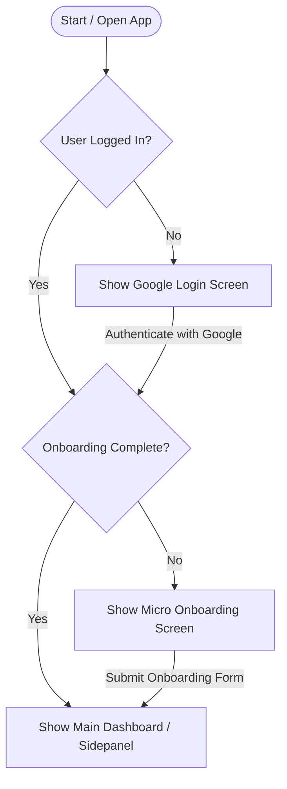

# AutoApplyAI Application Flow & Onboarding Documentation

This document outlines the strict application entry flow, user states, and onboarding requirements for **AutoApplyAI** (both Chrome Extension and Web Dashboard).

---

## 1. Unified Application Flow

To ensure data integrity, user configurations must always follow this strict state machine flow before any main features (such as resume tailoring or dashboard workspace) are accessible:



### Flow States
1. **`SHOW_LOGIN`**: Rejection/gate state when the user is not authenticated. The app restricts access and renders the "Sign in with Google" view.
2. **`SHOW_ONBOARDING`**: Gate state when the user has authenticated but hasn't completed their setup. The app renders a mandatory forms page. No workspace features are accessible.
3. **`SHOW_DASHBOARD`**: Active state when the user is authenticated and onboarding is complete. Main workspace screens are unlocked.

---

## 2. Onboarding Requirements

The onboarding screen demands a set of mandatory configurations. Part of the details are auto-populated from the user's Google Sign-In profile, and the remaining must be filled out by the candidate.

### Mandatory Fields
All of the following fields are strictly required:

| Field Name | Type | Source / Pre-population | Description / Format |
|---|---|---|---|
| `firstName` | `string` | Google Profile (First Name) | Candidate's first name. |
| `lastName` | `string` | Google Profile (Last Name) | Candidate's last name. |
| `email` | `string` | Google Profile (Email Address) | Candidate's email contact. |
| `phone` | `string` | User Input | Candidate's phone number (e.g., `555-555-5555`). |
| `geminiApiKey` | `string` | User Input | Gemini API key used for tailoring (e.g., starts with `AIzaSy`). |
| `outputDir` | `string` | User Input | Display label for the output folder (folder name from picker). Authoritative write handle lives in IndexedDB — not `customer_config`. |
| `resume` | `string` | File Upload (PDF) | PDF resume file name. Saved locally & referenced. |

### Configuration Structure (`customer_config`)
The final structure generated upon completing onboarding is:

```json
{
  "customerId": "customer_fname_lname",
  "geminiApiKey": "YOUR_GEMINI_API_KEY",
  "outputDir": "MyResumes",
  "candidateProfile": {
    "firstName": "f_name",
    "lastName": "l_name",
    "email": "f_namel_name@gmail.com",
    "phone": "555-555-5555",
    "resume": "xxx.pdf"
  }
}
```

*Note on `customerId`*: The identifier is derived dynamically by cleaning and joining the first name and last name: `customer_{first_name}_{last_name}` (alphanumeric only, lowercase).

---

## 3. Storage & Synchronization

Onboarding data is persisted through two modes to guarantee seamless access:
1. **Local Storage**: 
   - Chrome Extension: `chrome.storage.local`
   - Web Dashboard: `localStorage`
2. **Cloud Synchronization**: Saved directly to Google Cloud Firestore under `/users/{uid}/userData/userData` for cross-device syncing.

---

## 4. Verification and Unit Tests

The state transitions and configuration completeness rules are verified programmatically.

### Test Runner Command
To execute the flow verification test suite:
```bash
npm run test
```

### Verified Assertions
- `customerId` construction cleans and formats inputs to `customer_first_last`.
- Any missing mandatory parameters in `customer_config` correctly flag the configuration as incomplete.
- Empty candidate profile fields (e.g., missing phone or resume name) trigger validation rejection.
- Flow resolver routes unauthenticated users to the Login panel.
- Flow resolver routes authenticated users without complete configurations to the Onboarding gate.
- Flow resolver successfully unlocks the main workspace once onboarding is complete.
- **Extension sidepanel:** shows a single “Securing connection…” state until `waitForAuthGateway()` finishes and one launch cloud sync completes — prevents onboarding ↔ home flicker during startup.

---

## 5. Phase 1 Pipeline (Add → Tailor → Assist Apply)

The sidepanel **Home** tab runs the application pipeline. The background service worker owns queue orchestration.

### Stages
| Stage | Meaning |
|---|---|
| `queued` | Job captured; waiting for tailor slot |
| `tailoring` | AI Pass 1 + Pass 2 running (up to 2 concurrent) |
| `tailored` | Resume/cover letter ready; artifacts saving |
| `applying` | Tab focused; assist-apply adapter prefilling |
| `needs_review` | Prefill done — **user submits manually** |
| `applied` | User marked submission complete |
| `failed` | Tailor or apply error (retry available) |

### Concurrency
- **Tailor:** up to 2 jobs in parallel (`maxConcurrentTailors`)
- **Apply:** strictly one job at a time (requires focus on job tab)
- **Pause:** freezes tailor + apply; queued jobs remain

### Output folders (under onboarding output directory)
```
resume_tex/
coverletter_tex/
resume_pdf/
coverletter_pdf/
```

Files are written via the File System Access API handle saved at onboarding. Re-select the output folder if write permission expires.

### Assist apply (MVP)
- **LinkedIn** and **Greenhouse** adapters prefill contact fields + AI free-text answers
- Other platforms use a generic field matcher (capture + tailor always work)
- AI answers are highlighted on-page; user reviews before submit
- **No auto-submit** in Phase 1

### Storage keys
- `pipeline_queue_v1` — job queue (mirrored to `localHistory` for compatibility)
- `pipeline_settings_v1` — `{ paused, maxConcurrentTailors, autoStartApply }`
- `output_dir_label` — chrome.storage.local display label for the picked output folder
- IndexedDB `autoapplyai-fs` — persisted `outputDir` handle for artifact writes (authoritative for folder selection)
- Get Started folder picker delegates to the active tab's content script (`OPEN_NATIVE_DIRECTORY_PICKER` → native OS dialog); falls back to `directory-picker.html` when no injectable tab is available
