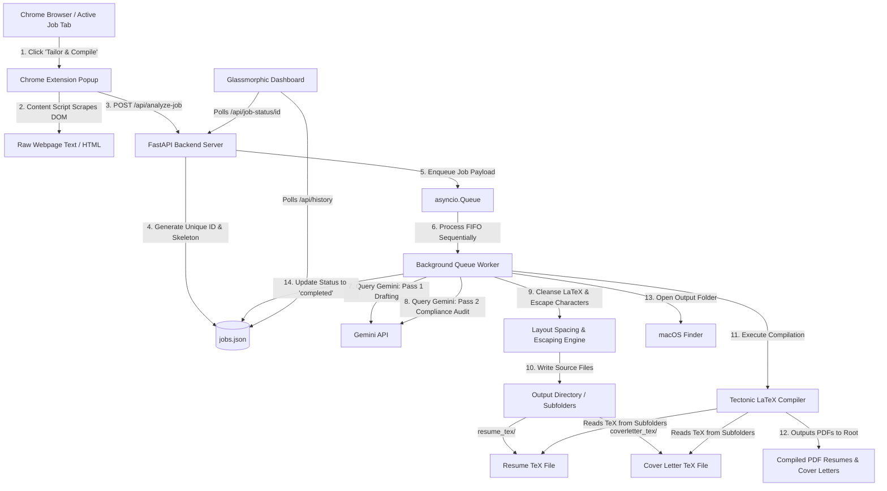

# AutoApplyAI Bot

An automated resume tailoring system powered by Python/FastAPI, Google Gemini API, and Tectonic LaTeX typesetting. It enables 1-click tailored resume generation and PDF compilation directly from job listings (LinkedIn, Indeed) via a Chrome Extension and an elegant glassmorphic dashboard.

---

## Table of Contents
1. [Overview & Audience](#overview--audience)
2. [End-to-End System Architecture](#end-to-end-system-architecture)
3. [End-to-End Flow (Non-Technical Explanation)](#end-to-end-flow-non-technical-explanation)
4. [Technical Deep-Dive: Under the Hood (Technical Explanation)](#technical-deep-dive-under-the-hood-technical-explanation)
   - [Chrome Extension Scraper & Dual-Port Fallback](#1-chrome-extension-scraper--dual-port-fallback)
   - [Asynchronous FIFO Queue & Concurrency Safety](#2-asynchronous-fifo-queue--concurrency-safety)
   - [Double-Pass Gemini Optimization Engine](#3-double-pass-gemini-optimization-engine)
   - [Dynamic LaTeX Escaping & Page Spacing Guardrails](#4-dynamic-latex-escaping--page-spacing-guardrails)
   - [Subdirectory Compilation Pipeline (Tectonic)](#5-subdirectory-compilation-pipeline-tectonic)
   - [Interruption Startup Recovery](#6-interruption-startup-recovery)
5. [Directory Structure](#directory-structure)
6. [Detailed Installation & Setup](#detailed-installation--setup)
   - [Method A: Docker Setup (Recommended)](#method-a-docker-setup-recommended)
   - [Method B: Native macOS Setup](#method-b-native-macos-setup)
7. [Chrome Extension Setup](#chrome-extension-setup)
8. [Configuration & Settings Modal](#configuration--settings-modal)
9. [Verification & Testing](#verification--testing)

---

## Overview & Audience

This application is designed for both **job seekers** looking to optimize their resumes for Applicant Tracking Systems (ATS) and **developers** interested in asynchronous queuing, containerization, and LLM-to-compiler pipelines.
- **For Non-Technical Users**: It automates the tedious chore of editing your resume for every job. You click a single button on a job page, and seconds later, a perfectly tailored PDF resume and cover letter appear in your downloads folder.
- **For Technical Developers**: It illustrates how to hook a stateless browser extension to an async queue-based python backend, query generative models with strict schema constraints, scrub and parse markup syntax defensively, and compile document bundles programmatically.

---

## End-to-End System Architecture

The following diagram illustrates how data flows through the extension, backend service, queue, LLM, and compilers:



---

## End-to-End Flow (Non-Technical Explanation)

Here is exactly what happens when you click the tailoring button:

1. **Scraping**: The Chrome extension acts as an automated reader. It scans the job listing (even bypassing hidden sections) to extract the job title, company name, and description.
2. **Immediate Queueing**: To ensure you don't experience browser freeze, the server assigns a unique number to your request (e.g. `1781052739_303000`) and places it in a virtual waiting line (the queue). The extension immediately displays "Queued" and lets you browse other tabs.
3. **Queue Processing**: A background worker processes the applications in the queue one-by-one. This prevents your computer from slowing down or crashing if you click "Tailor" on multiple jobs rapidly.
4. **Drafting (Pass 1)**: The AI analyzes the job description and your base resume, drafts a customized professional summary (matching keywords like React, AWS, or e-commerce), and creates tailored competencies.
5. **Auditing & Refining (Pass 2)**: A second AI check audits the draft against strict rules:
   - It verifies that the text fits within spacing limits (maximum 5 summary sentences and 8 competencies).
   - It strips out irrelevant industry jargon (for example, removing "clinical" or "healthcare" terms if you are applying to a retail or tech company).
   - It checks that the computed ATS match score is 90% or higher.
6. **Syntax Guardrails**: The server cleanses the text, replacing characters like `&` with `and` and escaping symbols like `%` so the document compiler doesn't glitch.
7. **Organizing & Compiling**: The server creates two subfolders in your default output folder: `resume_tex` and `coverletter_tex`. It saves the raw formatting files (.tex) there to keep your main folder clean. Tectonic then compiles the documents and outputs clean PDF files directly to your main folder.
8. **Auto-Open**: If running natively on Mac, a Finder window automatically opens the folder, showcasing your tailored `bhagath_resume_{company}_{title}.pdf` and `cover_letter_{company}_{title}.pdf` ready to upload.
9. **Dashboard Synced**: The web dashboard updates in real-time, showing success badges or error reports and letting you copy summaries or cover letters with 1 click.

---

## Technical Deep-Dive: Under the Hood (Technical Explanation)

### 1. Chrome Extension Scraper & Dual-Port Fallback
- **DOM Scraping**: `extension/popup.js` executes `scrapeJobPage` inside the active tab using `chrome.scripting.executeScript`. It uses a defensive selector waterfall targeting common containers (e.g., `.jobs-description__content` on LinkedIn, `#jobDescriptionText` on Indeed) and falls back to `document.body.innerText`.
- **Dual-Port Communication Fallback**: To support both native macOS deployment (port `3000`) and containerized Docker execution (port `8000`) concurrently, the popup attempts to contact `http://localhost:3000` first. If the request fails (due to connection refused), it automatically falls back to `http://localhost:8000`.

### 2. Asynchronous FIFO Queue & Concurrency Safety
- **FastAPI Startup Task**: On FastAPI startup, an asynchronous task running `queue_worker()` is created in the background using `asyncio.create_task`.
- **`asyncio.Queue`**: Serves as the FIFO storage. Requests to `/api/analyze-job` return immediately with a success flag, the unique job ID, and a `pending` status after pushing the job data into the queue with `await job_queue.put()`.
- **Locking & Thread-Safety**: Since multiple jobs might read/write the central history file (`jobs.json`) concurrently, `server.py` guards all I/O operations with `asyncio.Lock()` (`history_lock`).
- **Timestamp Microsecond Suffix**: Job IDs are generated using `f"{int(time.time())}_{int(time.time_ns() % 1000000):06d}"` (microseconds). This guarantees uniqueness even if requests are sent in parallel.

### 3. Double-Pass Gemini Optimization Engine
- **Pass 1 (Drafting)**: Queries the Gemini API model `gemini-2.5-flash` with a JSON schema. The prompt passes system rules (like summary sentences limit and core competency count) along with base profile data and the job description.
- **Pass 2 (Compliance Review)**: Takes the Pass 1 draft and feeds it back to the Gemini model inside a validation prompt. It acts as an auditor, scanning for missing keywords, validating layout constraints, adjusting seniority-based historical titles, and ensuring forbidden jargon is omitted.
- **Self-Healing Fallback**: If Pass 2 connection timeouts occur or JSON parsing fails, the server catches the exception and falls back to the Pass 1 draft results, updating status to `completed` rather than failing the pipeline.

### 4. Dynamic LaTeX Escaping & Page Spacing Guardrails
- **Character Sanitizer**: `clean_latex()` uses regular expressions to scrub characters that break LaTeX compilation. It replaces unescaped `&` with `and`, escapes `%` -> `\%`, and cleans curly quotes.
- **Tone word replacements**: Substitutes forbidden buzzwords (e.g. replacing `trajectory` with `journey`).
- **Layout Spacing Defense**: Strips out compiler-loop-inducing environments like nested `\begin{itemize}` or `\begin{quote}` blocks generated by the model. 
- **Vertical Spacers**: The resume template `base_template.tex` replaces static vertical spacing (`\vspace`) with LaTeX rubber vertical spring stretchers (`\vfill`). These expand or shrink dynamically to fit the text, defending the 1-page budget.

### 5. Subdirectory Compilation Pipeline (Tectonic)
- **Folder Isolation**: To prevent cluttering the output directory with intermediate compilation assets, the server creates `resume_tex/` and `coverletter_tex/` subfolders under the configured `output_dir`.
- **Tectonic Compilation**: Executes Tectonic via Python `subprocess.run` inside `run_in_executor` to avoid blocking FastAPI's main event loop thread:
  ```bash
  tectonic -o "{output_dir}" "{output_dir}/resume_tex/bhagath_resume_{company}_{title}.tex"
  ```
  The `-o` flag forces the compiler to read the `.tex` files from the subdirectories but write the compiled `.pdf` files directly in the root of the output directory.

### 6. Interruption Startup Recovery
- **FASTAPI `@app.on_event("startup")`**: Scans the database `jobs.json` for any items with status `"pending"` or `"processing"`.
- **Re-queuing**: Reverses the items (since history is stored newest-first) and pushes them back into `asyncio.Queue` using `await job_queue.put()`. This ensures that if the server crashes or restarts, all incomplete jobs are restored in chronological order.

---

## Directory Structure

```
├── server.py                   # FastAPI server (routing, scraping, queueing, compiling)
├── config.py                   # Master system prompt and rules configuration
├── resume_rules.json           # Layout parameters, escapes, substitutions, and output folders
├── base_template.tex           # LaTeX resume template with dynamic spring spacing (\vfill)
├── cover_letter_template.tex   # LaTeX cover letter template
├── requirements.txt            # Python dependencies (fastapi, uvicorn, requests, dotenv)
├── Dockerfile                  # Alpine image installing python, pip packages, and tectonic
├── .dockerignore               # Restricts copying build artifacts and logs into containers
├── jobs.json                   # Central JSON database storing application details and statuses
├── extension/                  # Chrome Extension Source
│   ├── manifest.json           # Extension permissions and background declaration
│   ├── popup.html/css/js       # Scraper trigger, port fallbacks, and progress indicators
│   └── content.js              # Injectable scraper helper
├── public/                     # Glassmorphic Web Dashboard
│   ├── index.html              # 3-Pane dashboard layout with queue loaders
│   ├── style.css               # Styling variables, glassmorphic cards, animations
│   └── app.js                  # 3-second polling, status badges, details rendering
└── scratch/                    # Verification & Testing Scripts
    ├── test_rules.py           # Verifies syntax escaping, margins, and compiles test resume
    ├── test_cover_letter_gen.py# Verifies cover letter compilation
    └── test_queue_e2e.py       # Simulates rapid concurrent queuing and sequential processing
```

---

## Detailed Installation & Setup

### Method A: Docker Setup (Recommended)
This method runs the application containerized. It automatically handles the installation of the Python server and the LaTeX Tectonic compiler so you don't have to install them on the host Mac.

#### 1. Install Docker Desktop
- Download and install [Docker Desktop for Mac](https://www.docker.com/products/docker-desktop/) (select the Apple Silicon version for M1/M2/M3/M4 chips, or Intel version otherwise).
- Open Docker Desktop and ensure the engine is active.

#### 2. Create Configuration File
Create a `config.json` in the root of the cloned directory on your host Mac with your Gemini API Key:
```json
{
  "geminiApiKey": "YOUR_GEMINI_API_KEY"
}
```

#### 3. Build the Docker Image
Navigate to the repository folder in Terminal and build the image:
```bash
docker build -t resume-pipeline-bot .
```

#### 4. Run the Container
Start the container. We map the host's `config.json` directly into the container so that API keys can be configured persistently, and we map `~/Downloads` (or your preferred folder) as the output target:
```bash
docker run -d \
  -p 8000:8000 \
  -v $(pwd)/config.json:/app/config.json \
  -v ~/Downloads:/app/output \
  --name resume-bot-instance \
  resume-pipeline-bot
```
The server will start at [http://localhost:8000](http://localhost:8000).

---

### Method B: Native macOS Setup
Use this method if you prefer to run the server directly on your host Mac's Python environment.

#### 1. Install Homebrew and Tectonic
- Install [Homebrew](https://brew.sh/) if it's not already installed.
- Install Tectonic:
  ```bash
  brew install tectonic
  ```

#### 2. Configure Virtual Environment & Packages
Create a virtual environment and install the required dependencies:
```bash
python3 -m venv venv
source venv/bin/activate
pip install -r requirements.txt
```

#### 3. Launch the Server
```bash
python3 server.py
```
The server will start at [http://localhost:3000](http://localhost:3000).

---

## Chrome Extension Setup

1. Open Google Chrome on your Mac and navigate to `chrome://extensions/`.
2. Enable **Developer mode** using the toggle switch in the top-right.
3. Click **Load unpacked** in the top-left.
4. Select the `dist` folder inside the cloned `AutoApplyAI` directory.

The extension is now ready. It will automatically detect whether port `3000` (native) or port `8000` (Docker) is active.

---

## Configuration & Settings Modal

Click the **Gear Icon** in the top header of the web dashboard to open the settings modal:
- **Gemini API Key**: Input your key here to save it. You can click the **Eye Icon** to unmask and review the key.
- **Resume Output Folder**: Displays the compilation directory.
- **Browse Button**: (Native macOS only) Clicking **Browse** runs a native AppleScript dialog, allowing you to select any folder on your Mac's filesystem and saving the absolute path back to `resume_rules.json`.

---

## Verification & Testing

Verify system integrity using the test suite located in `scratch/`:

1. **Verify Escapes, Tone, and Layout Spacing**:
   ```bash
   python3 scratch/test_rules.py
   ```
2. **Verify Cover Letter Generation**:
   ```bash
   python3 scratch/test_cover_letter_gen.py
   ```
3. **Verify Queue Processing & Sequency (E2E simulation)**:
   Ensure the server is running on port 3000, and run:
   ```bash
   python3 scratch/test_queue_e2e.py
   ```
   This script submits multiple requests concurrently, monitoring their state as they progress sequentially from `pending` -> `processing` -> `completed`/`failed`.
